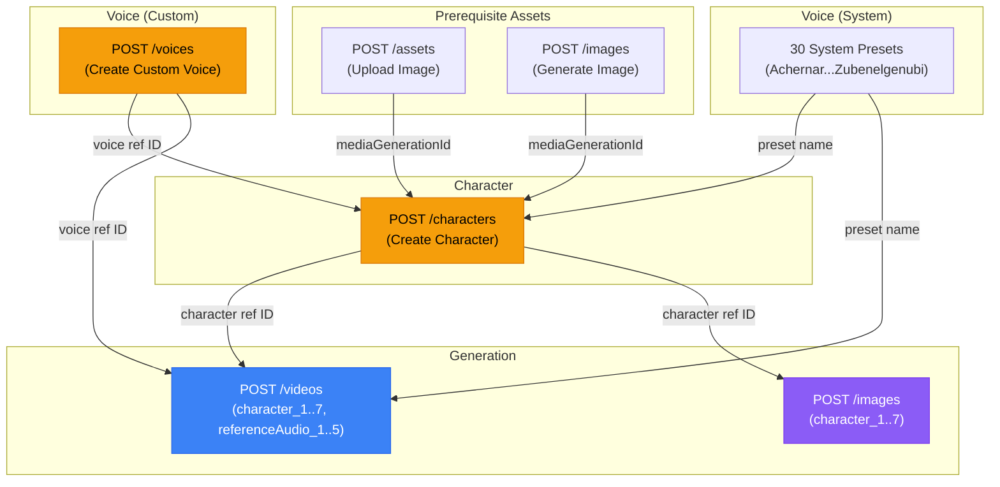

# Voice & Character — UseAPI Google Flow

> Dokumentasi gabungan untuk **Custom Voice** dan **Character** API.
> Kedua fitur saling terkait: Character bisa di-attach Voice, dan keduanya dipakai di Video/Image generation.

---

## Daftar Isi

1. [Overview & Relasi](#overview--relasi)
2. [System Voice Presets](#system-voice-presets)
3. [UseAPI Endpoints — Voice](#useapi-endpoints--voice)
4. [UseAPI Endpoints — Character](#useapi-endpoints--character)
5. [Model Compatibility](#model-compatibility)
6. [Database Schema](#database-schema)
7. [Internal API Routes](#internal-api-routes)
8. [Client-Side API](#client-side-api)
9. [Integrasi Video & Image Generation](#integrasi-video--image-generation)
10. [Credit Cost](#credit-cost)
11. [Email Pinning](#email-pinning)
12. [UI Components](#ui-components)
13. [Files & Implementation Status](#files--implementation-status)

---

## Overview & Relasi



**Summary:**
- **Voice** = TTS clip (system preset ATAU custom-made). Bisa dipakai langsung di video (`referenceAudio_1..5`) atau di-attach ke Character.
- **Character** = Bundel 1–2 reference images + opsional voice. Bisa di-reference dari video/image generation via `character_1..7`.

---

## System Voice Presets

30 voice presets bawaan Google Flow. Bisa dipakai langsung tanpa perlu create custom voice:

```
Achernar, Achird, Algenib, Algieba, Alnilam, Aoede, Autonoe, Callirrhoe,
Charon, Despina, Enceladus, Erinome, Fenrir, Gacrux, Iapetus, Kore,
Laomedeia, Leda, Orus, Puck, Pulcherrima, Rasalgethi, Sadachbia,
Sadaltager, Schedar, Sulafat, Umbriel, Vindemiatrix, Zephyr, Zubenelgenubi
```

Preview audio: `https://www.gstatic.com/aitestkitchen/voices/samples/{Name}.wav`

> [!NOTE]
> System voice preset names **case-insensitive** saat dipakai di `voice` param Character, tapi **case-sensitive** saat create custom voice (param `voice` di `POST /voices`).

---

## UseAPI Endpoints — Voice

Base URL: `https://api.useapi.net/v1/google-flow`

### 1. Create Custom Voice

**`POST /voices`** — Captcha required.

Buat custom voice dari salah satu 30 system voice presets + dialog text + delivery style.

#### Request

```json
{
  "email": "john@gmail.com",
  "voice": "Achernar",
  "dialog": "Hello, this is a test voice.",
  "voicePerformance": "Cheerful, energetic delivery",
  "displayName": "Cheerful Narrator"
}
```

| Param | Required | Type | Range | Notes |
|---|---|---|---|---|
| `email` | ✅ | string | — | Google Flow account email |
| `voice` | ✅ | string | — | System voice preset (case-sensitive) |
| `displayName` | ✅ | string | 1-200 | User-facing label |
| `dialog` | ✅ | string | 1-120 | Teks preview audio |
| `voicePerformance` | ✅ | string | 1-120 | Delivery style (e.g. "Cheerful, energetic") |
| `captchaToken` | — | string | — | Mutually exclusive dengan captchaRetry/captchaOrder |
| `captchaRetry` | — | number | 1-10 | Auto-retry attempts |
| `captchaOrder` | — | string | — | Provider order |

#### Response (200 OK)

```json
{
  "voice": "user:12345-email:6a6f...-voice:d990a2f9-...-mid:d55b6d59-...",
  "source": "user",
  "workflowId": "d990a2f9-...",
  "mediaId": "d55b6d59-...",
  "displayName": "Cheerful Narrator",
  "baseVoice": "Achernar",
  "dialog": "Hello, this is a test voice.",
  "voicePerformance": "Cheerful, energetic delivery",
  "audioUrl": "https://flow-content.google/audio/d55b6d59-...?Expires=...&KeyName=...&Signature=..."
}
```

| Field | Type | Notes |
|---|---|---|
| `voice` | string | **Reference ID** — gunakan untuk `referenceAudio_1..5` atau `voice` di Character |
| `source` | `"user"` | Selalu "user" untuk custom voice |
| `workflowId` | string | Internal workflow ID |
| `mediaId` | string | Media ID |
| `displayName` | string | Label |
| `baseVoice` | string | System preset yang dipilih |
| `dialog` | string | Teks preview |
| `voicePerformance` | string | Delivery style |
| `audioUrl` | string? | Signed playback URL (~6h TTL). Kadang absent. |

---

### 2. List Voices

**`GET /voices?email={email}`**

Returns semua voices (system + user custom) untuk account tersebut.

---

### 3. Refresh Voice Audio URL

**`GET /voices/ref?voice={voiceRefId}`**

Returns fresh signed `audioUrl` (~6h TTL).

---

### 4. Delete Custom Voice

**`DELETE /voices/ref?voice={voiceRefId}`**

Hapus custom voice dari account.

---

## UseAPI Endpoints — Character

### 1. Create Character

**`POST /characters`** — Captcha NOT required (berdasarkan docs UseAPI).

Buat character = bundel 1–2 reference images + opsional voice.

#### Request

```json
{
  "displayName": "Carol",
  "personalityNotes": "A curious traveler with a sharp wit",
  "imageReference_1": "user:12345-email:6a6f...-image:abc123...",
  "imageReference_2": "user:12345-email:6a6f...-image:def456...",
  "voice": "user:12345-email:6a6f...-voice:d990a2f9-...-mid:d55b6d59-..."
}
```

| Param | Required | Type | Range | Notes |
|---|---|---|---|---|
| `displayName` | ✅ | string | 1-200 | Nama karakter |
| `imageReference_1` | ✅ | string | — | `mediaGenerationId` dari `/assets` atau `/images` |
| `imageReference_2` | — | string | — | Max 2 images per character |
| `personalityNotes` | — | string | 0-2000 | Deskripsi kepribadian |
| `voice` | — | string | — | System preset name (case-insensitive) **ATAU** user voice ref ID dari `POST /voices` |

#### Voice Options

Parameter `voice` di Character menerima **dua jenis input**:

| Jenis | Contoh | Notes |
|---|---|---|
| System preset | `"Umbriel"` | Langsung pakai, case-insensitive |
| Custom voice ref | `"user:12345-email:6a6f...-voice:d990a2f9-...-mid:d55b6d59-..."` | Dari response `POST /voices` |

#### Response (200 OK)

```json
{
  "entityId": "f470f1b5-...",
  "character": "user:12345-email:6a6f...-character:f470f1b5-...-imgs:2-voice:d990a2f9-...",
  "displayName": "Carol",
  "personalityNotes": "A curious traveler with a sharp wit",
  "imageReferences": [
    { "mediaId": "abc123..." },
    { "mediaId": "def456..." }
  ],
  "voice": "user:12345-email:6a6f...-voice:d990a2f9-...-mid:d55b6d59-..."
}
```

| Field | Type | Notes |
|---|---|---|
| `entityId` | string | Internal entity ID |
| `character` | string | **Reference ID** — gunakan untuk `character_1..7` |
| `displayName` | string | Nama |
| `personalityNotes` | string? | Deskripsi |
| `imageReferences` | `{ mediaId }[]` | Image refs yang di-attach |
| `voice` | string? | Echoed: user voice → ref ID, system voice → Title-case name |

---

### 2. List Characters

**`GET /characters?email={email}`**

---

### 3. Delete Character

**`DELETE /characters/ref?character={characterRefId}`**

---

## Model Compatibility

### Character Support per Model

| Model | Character Support | Image Budget | Voice Budget | Duration |
|---|---|---|---|---|
| `veo-3.1-quality` | ✗ | n/a | n/a | n/a |
| `veo-3.1-fast` | ✓ (Ingredients mode) | 3 total | 1 voice | 8s only |
| `veo-3.1-lite` | ✓ (Ingredients mode) | 3 total | 1 voice | 8s only |
| `veo-3.1-lite-low-priority` | ✓ (Ingredients mode) | 3 total | 1 voice | 8s only |
| `omni-flash` | ✓ (Ingredients mode) | 7 total | 5 voices | 4/6/8/10s |

### Image Budget = SHARED POOL

```
character images + raw referenceImage_* refs = total image budget
```

Contoh valid (omni-flash, budget 7):
```
✅ char_1(2 img) + char_2(2 img) + 3 referenceImage = 7
✅ char_1(1 img) + 6 referenceImage = 7
✅ 7 chars × 1 img each = 7
❌ char_1(2 img) + char_2(2 img) + 4 referenceImage = 8 → REJECTED
```

> [!WARNING]
> Veo models (non-quality) **hanya support 8-second duration** saat menggunakan Characters. Duration 4s/6s akan di-reject.

### Voice in Video (tanpa Character)

Voice bisa juga dipakai langsung di `POST /videos` via `referenceAudio_1..5` tanpa Character:

| Model | Slots | Notes |
|---|---|---|
| Veo (non-quality, R2V) | `referenceAudio_1` only | 1 voice |
| omni-flash (R2V) | `referenceAudio_1..5` | Up to 5 voices |
| omni-flash (V2V edit) | `referenceAudio_1..3` | Up to 3 voices |

---

## Database Schema

Dua model baru di `prisma/schema.prisma`:

```prisma
model user_voices {
  id                String   @id @default(uuid())
  userId            String
  voiceRefId        String   @unique  // "user:12345-email:...-voice:...-mid:..."
  displayName       String
  baseVoice         String             // system preset name (e.g. "Achernar")
  dialog            String             // preview text (1-120 chars)
  voicePerformance  String             // delivery style (1-120 chars)
  audioUrl          String?            // signed URL (~6h TTL, refresh via GET /voices/ref)
  workflowId        String?
  mediaId           String?
  email             String             // Google Flow account email
  createdAt         DateTime @default(now())
  updatedAt         DateTime @updatedAt
  users             users    @relation(fields: [userId], references: [id], onDelete: Cascade)

  @@index([userId, createdAt(sort: Desc)])
  @@index([userId])
}

model user_characters {
  id               String   @id @default(uuid())
  userId           String
  characterRefId   String   @unique  // "user:12345-email:...-character:...-imgs:N-voice:..."
  entityId         String             // Google Flow entity ID
  displayName      String
  personalityNotes String?
  imageRef1        String             // mediaGenerationId image 1
  imageRef2        String?            // mediaGenerationId image 2 (optional)
  voiceType        String?            // "system" | "custom" | null
  voiceValue       String?            // system preset name OR user voice ref ID
  email            String             // Google Flow account email
  createdAt        DateTime @default(now())
  updatedAt        DateTime @updatedAt
  users            users    @relation(fields: [userId], references: [id], onDelete: Cascade)

  @@index([userId, createdAt(sort: Desc)])
  @@index([userId])
}
```

**Tambahkan relasi di model `users`:**

```prisma
model users {
  // ... existing fields ...
  user_voices       user_voices[]
  user_characters   user_characters[]
}
```

### Kenapa Perlu DB Model?

1. **Cache** — Tidak perlu query UseAPI setiap kali list voices/characters
2. **User association** — Tahu voice/character milik user mana
3. **Faster UI** — List voices/characters langsung dari DB, refresh audioUrl on-demand
4. **Delete tracking** — Bisa soft-delete atau track history
5. **Credit audit** — Tahu kapan voice/character dibuat, bisa cross-reference credit_transactions

### Sync Strategy

```
Create: POST UseAPI → success → insert DB row → return to client
Delete: DELETE UseAPI → success → delete DB row → return to client
List:   Query DB first (fast) → optional background sync with UseAPI
Refresh audioUrl: GET UseAPI /voices/ref → update DB row → return fresh URL
```

---

## Internal API Routes

### Voice Routes

#### `POST /api/ai/voices/create`

Create custom voice → UseAPI `POST /voices` + insert DB.

```typescript
// Request Body
{
  voice: string,           // system preset name (required)
  dialog: string,          // 1-120 chars (required)
  voicePerformance: string, // 1-120 chars (required)
  displayName: string,     // 1-200 chars (required)
  email?: string           // auto-select jika kosong
}

// Response
{
  voice: string,           // ref ID
  source: "user",
  displayName: string,
  baseVoice: string,
  dialog: string,
  voicePerformance: string,
  audioUrl?: string,
  creditsDeducted: 3
}
```

**Server Logic:**
1. Auth check
2. Validate: voice name ∈ 30 presets, lengths valid
3. Credit check ≥ 3, deduct 3 credits (feature: `"custom-voice"`)
4. Get captcha token from broker
5. `POST` UseAPI `/voices` (retry on 403 captcha)
6. On success → `prisma.user_voices.create(...)` insert DB row
7. Return response

---

#### `GET /api/ai/voices/gflow`

List user's Google Flow voices (from DB, not UseAPI).

```typescript
// Response
{
  voices: [
    // User custom voices (from DB)
    {
      id: string,
      voiceRefId: string,
      displayName: string,
      baseVoice: string,
      dialog: string,
      voicePerformance: string,
      audioUrl?: string,      // might be expired
      source: "user",
      createdAt: string
    },
    // ... more voices
  ],
  systemVoices: [
    "Achernar", "Achird", ... // static list of 30 presets
  ]
}
```

**Server Logic:**
1. Auth check
2. `prisma.user_voices.findMany({ where: { userId } })`
3. Return DB rows + static system voice list

---

#### `GET /api/ai/voices/ref?voice={voiceRefId}`

Refresh audioUrl dari UseAPI (karena TTL ~6h).

**Server Logic:**
1. Auth check
2. `GET` UseAPI `/voices/ref?voice={voiceRefId}`
3. Update `audioUrl` di DB
4. Return fresh `{ audioUrl }`

---

#### `DELETE /api/ai/voices/ref?voice={voiceRefId}`

Delete custom voice.

**Server Logic:**
1. Auth check
2. Verify voice belongs to user (check DB)
3. `DELETE` UseAPI `/voices/ref?voice={voiceRefId}`
4. `prisma.user_voices.delete({ where: { voiceRefId } })`
5. Return `{ deleted: true }`

---

### Character Routes

#### `POST /api/ai/characters/create`

Create character → UseAPI `POST /characters` + insert DB.

```typescript
// Request Body
{
  displayName: string,        // 1-200 chars (required)
  imageReference_1: string,   // mediaGenerationId (required)
  imageReference_2?: string,  // mediaGenerationId (optional)
  personalityNotes?: string,  // 0-2000 chars
  voice?: string,             // system preset name OR user voice ref ID
  email?: string              // auto-select jika kosong
}

// Response
{
  entityId: string,
  character: string,          // ref ID
  displayName: string,
  personalityNotes?: string,
  imageReferences: [{ mediaId: string }],
  voice?: string,
  creditsDeducted: 3
}
```

**Server Logic:**
1. Auth check
2. Validate: displayName length, imageReference_1 exists
3. Credit check ≥ 3, deduct 3 credits (feature: `"custom-character"`)
4. Determine voice type: `null` | `"system"` (if preset name) | `"custom"` (if user ref ID)
5. `POST` UseAPI `/characters` (with captcha if needed)
6. On success → `prisma.user_characters.create(...)` insert DB row
7. Return response

---

#### `GET /api/ai/characters`

List user's characters (from DB).

```typescript
// Response
{
  characters: [
    {
      id: string,
      characterRefId: string,
      entityId: string,
      displayName: string,
      personalityNotes?: string,
      imageRef1: string,
      imageRef2?: string,
      voiceType?: string,    // "system" | "custom"
      voiceValue?: string,   // preset name or ref ID
      createdAt: string
    }
  ]
}
```

---

#### `DELETE /api/ai/characters/ref?character={characterRefId}`

Delete character.

**Server Logic:**
1. Auth check
2. Verify character belongs to user (check DB)
3. `DELETE` UseAPI `/characters/ref?character={characterRefId}`
4. `prisma.user_characters.delete({ where: { characterRefId } })`
5. Return `{ deleted: true }`

---

## Client-Side API

Tambahkan di `lib/api/google-flow.ts`:

```typescript
/* ─── Voice Types ─── */

export const SYSTEM_VOICE_PRESETS = [
  "Achernar", "Achird", "Algenib", "Algieba", "Alnilam",
  "Aoede", "Autonoe", "Callirrhoe", "Charon", "Despina",
  "Enceladus", "Erinome", "Fenrir", "Gacrux", "Iapetus",
  "Kore", "Laomedeia", "Leda", "Orus", "Puck",
  "Pulcherrima", "Rasalgethi", "Sadachbia", "Sadaltager",
  "Schedar", "Sulafat", "Umbriel", "Vindemiatrix", "Zephyr",
  "Zubenelgenubi",
] as const

export type SystemVoicePreset = typeof SYSTEM_VOICE_PRESETS[number]

export interface CustomVoice {
  id: string
  voiceRefId: string
  displayName: string
  baseVoice: string
  dialog: string
  voicePerformance: string
  audioUrl?: string
  source: "user"
  createdAt: string
}

export interface CreateVoiceParams {
  voice: string            // system preset name
  dialog: string           // 1-120 chars
  voicePerformance: string // 1-120 chars
  displayName: string      // 1-200 chars
  email?: string
}

/* ─── Character Types ─── */

export interface Character {
  id: string
  characterRefId: string
  entityId: string
  displayName: string
  personalityNotes?: string
  imageRef1: string
  imageRef2?: string
  voiceType?: "system" | "custom"
  voiceValue?: string
  createdAt: string
}

export interface CreateCharacterParams {
  displayName: string       // 1-200 chars
  imageReference_1: string  // mediaGenerationId
  imageReference_2?: string
  personalityNotes?: string // 0-2000 chars
  voice?: string            // system preset name OR user voice ref ID
  email?: string
}

/* ─── Voice Functions ─── */

export async function createCustomVoice(params: CreateVoiceParams): Promise<CustomVoice & { creditsDeducted: number }>
export async function listUserVoices(): Promise<{ voices: CustomVoice[], systemVoices: string[] }>
export async function refreshVoiceAudio(voiceRefId: string): Promise<{ audioUrl: string }>
export async function deleteCustomVoice(voiceRefId: string): Promise<void>

/* ─── Character Functions ─── */

export async function createCharacter(params: CreateCharacterParams): Promise<Character & { creditsDeducted: number }>
export async function listCharacters(): Promise<{ characters: Character[] }>
export async function deleteCharacter(characterRefId: string): Promise<void>
```

---

## Integrasi Video & Image Generation

### Perubahan di `video-generate/route.ts`

Saat ini (line 141-143):
```typescript
const { prompt, model, aspectRatio, duration, count, seed,
  startImage, endImage, referenceImages, voice, email, feature } = body
```

Tambahkan `characters`:
```typescript
const { ..., characters } = body  // characters: string[] (ref IDs)
```

Di payload building (setelah line 198):
```typescript
if (characters && Array.isArray(characters)) {
  characters.forEach((charRef: string, i: number) => {
    basePayload[`character_${i + 1}`] = charRef
  })
}
```

### Perubahan di `GenerateVideoParams` (google-flow.ts)

```typescript
export interface GenerateVideoParams {
  // ... existing ...
  characters?: string[]     // character ref IDs → character_1..7
  referenceAudios?: string[] // voice ref IDs → referenceAudio_1..5
}
```

### Image Budget Validation (Server-side)

```typescript
function validateBudget(model: string, characters: string[], refImageCount: number): string | null {
  // Hitung total image dari characters (perlu lookup DB untuk tahu imageRef2 ada atau tidak)
  // Untuk sekarang, assume worst-case 2 images per character
  const charImageCount = characters.length * 2  // conservative
  const total = charImageCount + refImageCount
  const max = model.startsWith("veo-") ? 3 : 7  // omni-flash = 7
  
  if (total > max) {
    return `Total image refs (${total}) melebihi batas ${model} (${max})`
  }
  return null
}
```

---

## Credit Cost

| Fitur | Credit | Feature Key |
|---|---|---|
| Create Custom Voice | **3** | `custom-voice` |
| Create Character | **3** | `custom-character` |
| Delete Voice/Character | **0** (gratis) | — |
| List Voice/Character | **0** (gratis) | — |
| Refresh Voice Audio | **0** (gratis) | — |

Tambahkan di `credit_costs` table (seed):
```sql
INSERT INTO credit_costs (id, feature, "creditCost", description, "isActive", "updatedAt")
VALUES
  (gen_random_uuid(), 'custom-voice', 3, 'Create custom voice on Google Flow', true, now()),
  (gen_random_uuid(), 'custom-character', 3, 'Create character on Google Flow', true, now());
```

---

## Email Pinning

> [!CAUTION]
> **CRITICAL**: Semua assets dalam operasi yang terkait HARUS dari email/account Google Flow yang sama:
>
> **Voice**: `email` param di `POST /voices` menentukan akun.
>
> **Character**: Kedua `imageReference_1` + `imageReference_2` harus dari akun yang sama. Jika `voice` adalah custom voice, voice tersebut juga harus dari akun yang sama.
>
> **Video/Image Generation**: Saat pakai `character_1..7`, semua characters + referenceImages harus dari akun yang sama.

### Email Resolution Strategy

Karena user tidak tahu (dan tidak perlu tahu) email mana yang dipakai:

1. **Auto-select**: Server pilih email dari pool akun
2. **Sticky session**: Setelah pertama kali, simpan email di DB row (voice/character)
3. **Validate on generate**: Saat submit video/image job, pastikan semua character/voice/references dari email yang sama

---

## UI Components

### Voice Picker Component (`components/voice-picker.tsx`)

Reusable, dipakai di:
- Character creation form (pilih voice untuk character)
- Video generator (pilih voice narration)
- Storyboard (pilih voice per scene)

```
┌──────────────────────────────────────────┐
│  🎤 Pilih Voice                    [×]   │
│                                          │
│  ┌─ Tab: System ──┐ ┌─ Tab: Custom ──┐  │
│  │                 │ │                │  │
│  │ Grid 30 presets │ │ List user      │  │
│  │ [▶ preview]     │ │ voices         │  │
│  │ [Select]        │ │ [▶ play]       │  │
│  │                 │ │ [Select] [🗑]  │  │
│  └─────────────────┘ └────────────────┘  │
│                                          │
│  [+ Buat Custom Voice Baru]              │
│                                          │
│  ┌─ Create Form (collapsed) ───────────┐ │
│  │ Base Voice: [dropdown 30 presets]    │ │
│  │ Display Name: [_______________]      │ │
│  │ Dialog: [_________________________]  │ │
│  │ Voice Performance: [______________]  │ │
│  │ [Buat Voice] (3 kredit)              │ │
│  └──────────────────────────────────────┘ │
└──────────────────────────────────────────┘
```

### Character Manager (`/dashboard/characters`)

```
┌──────────────────────────────────────────────────────┐
│  Characters                    [+ Buat Character]     │
│                                                       │
│  ┌──────────┐ ┌──────────┐ ┌──────────┐             │
│  │ [img1]   │ │ [img1]   │ │ [img1]   │             │
│  │ [img2]   │ │          │ │ [img2]   │             │
│  │ "Carol"  │ │ "Bob"    │ │ "Luna"   │             │
│  │ 🎤Umbriel│ │ No voice │ │ 🎤Custom │             │
│  │ [Use][🗑]│ │ [Use][🗑]│ │ [Use][🗑]│             │
│  └──────────┘ └──────────┘ └──────────┘             │
└──────────────────────────────────────────────────────┘
```

### Create Character Dialog

```
┌──────────────────────────────────────────┐
│  Buat Character Baru                [×]  │
│                                          │
│  Nama: [_______________] (max 200)       │
│                                          │
│  Reference Images:                       │
│  ┌─────────┐ ┌─────────┐                │
│  │ [Upload] │ │ [Upload] │ (opsional)    │
│  │ atau     │ │         │               │
│  │ [Gallery]│ │         │               │
│  └─────────┘ └─────────┘                │
│                                          │
│  Voice (opsional):                       │
│  ○ Tanpa voice                           │
│  ○ System preset: [dropdown]             │
│  ○ Custom voice: [picker]                │
│                                          │
│  Personality Notes (opsional):           │
│  [__________________________________]   │
│  [__________________________________]   │
│  (max 2000 chars)                        │
│                                          │
│  [Buat Character] (3 kredit)             │
└──────────────────────────────────────────┘
```

### Character Picker (di Video/Image Generator)

```
┌──────────────────────────────────────────┐
│  Characters (opsional)                   │
│                                          │
│  ┌──────┐ ┌──────┐ ┌─────────────────┐  │
│  │Carol │ │ Bob  │ │ [+ Tambah]      │  │
│  │  [×] │ │  [×] │ │                 │  │
│  └──────┘ └──────┘ └─────────────────┘  │
│                                          │
│  Image budget: 4/7 used                  │
│  ████████░░░░░░░░                        │
└──────────────────────────────────────────┘
```

---

## Files & Implementation Status

### Files (Planned)

| File | Status | Purpose |
|---|---|---|
| **Voice Routes** | | |
| `app/api/ai/voices/create/route.ts` | ❌ | POST — Create custom voice |
| `app/api/ai/voices/gflow/route.ts` | ❌ | GET — List user voices + system presets |
| `app/api/ai/voices/ref/route.ts` | ❌ | GET refresh / DELETE delete |
| **Character Routes** | | |
| `app/api/ai/characters/create/route.ts` | ❌ | POST — Create character |
| `app/api/ai/characters/route.ts` | ❌ | GET — List user characters |
| `app/api/ai/characters/ref/route.ts` | ❌ | DELETE — Delete character |
| **Shared / Modified** | | |
| `prisma/schema.prisma` | ⚠️ Modify | Add `user_voices` + `user_characters` models |
| `lib/api/google-flow.ts` | ⚠️ Modify | Add voice/character types + functions |
| `app/api/ai/video-generate/route.ts` | ⚠️ Modify | Add `characters[]` + `referenceAudios[]` support |
| `lib/features.ts` | ⚠️ Modify | Add feature entry (if needed) |
| **UI Components** | | |
| `components/voice-picker.tsx` | ❌ | Reusable voice picker (system + custom) |
| `components/character-picker.tsx` | ❌ | Reusable character picker |
| `components/character-card.tsx` | ❌ | Character display card |
| `app/dashboard/characters/page.tsx` | ❌ | Character manager page |
| **Existing — DO NOT MODIFY** | | |
| `app/api/ai/voices/route.ts` | ✅ | ElevenLabs voices — TERPISAH, jangan ubah |

### Implementation Checklist

| # | Task | Status | Dependency |
|---|---|---|---|
| 1 | Prisma schema: `user_voices` + `user_characters` | ❌ | — |
| 2 | `prisma generate` + migrate | ❌ | #1 |
| 3 | `POST /api/ai/voices/create` | ❌ | #2 |
| 4 | `GET /api/ai/voices/gflow` | ❌ | #2 |
| 5 | `GET /api/ai/voices/ref` | ❌ | #2 |
| 6 | `DELETE /api/ai/voices/ref` | ❌ | #2 |
| 7 | `POST /api/ai/characters/create` | ❌ | #2 |
| 8 | `GET /api/ai/characters` | ❌ | #2 |
| 9 | `DELETE /api/ai/characters/ref` | ❌ | #2 |
| 10 | Client API: voice functions | ❌ | #3-6 |
| 11 | Client API: character functions | ❌ | #7-9 |
| 12 | `video-generate/route.ts`: `characters[]` support | ❌ | #7 |
| 13 | Voice picker component | ❌ | #10 |
| 14 | Character picker component | ❌ | #11, #13 |
| 15 | Character manager page | ❌ | #14 |
| 16 | Integrasi voice picker di video generator | ❌ | #13 |
| 17 | Integrasi character picker di video generator | ❌ | #14 |
| 18 | Credit cost seed (`custom-voice`, `custom-character`) | ❌ | #2 |

> [!NOTE]
> Task #1-2 (Prisma) bisa dijalankan sekali untuk kedua model.
> Task #3-6 (Voice) dan #7-9 (Character) bisa dijalankan paralel setelah #2 selesai.
> Task #10-11 (Client API) bisa dijalankan paralel.
> Task #13-17 (UI) sequential karena character picker depends on voice picker.

---

## Environment Variables

Tidak perlu env variable baru. Semua sudah ada:
- `USEAPI_TOKEN` — UseAPI auth
- `CAPTCHA_BROKER_URL` + `CAPTCHA_BROKER_KEY` — Captcha
- `DATABASE_URL` — Prisma
